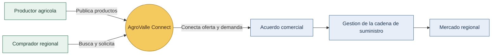
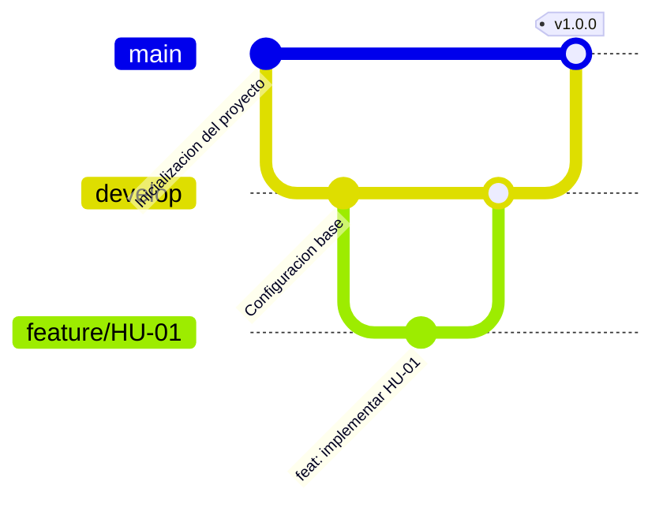

# AgroValle Connect

Plataforma digital para conectar a los productores del Valle del Cauca con mercados regionales y facilitar la comercializacion de productos agricolas.


## Vision del producto

AgroValle Connect integra productores locales, compradores y la cadena de suministro en un solo espacio digital. La plataforma busca mejorar la visibilidad de la oferta agricola, facilitar acuerdos comerciales y optimizar el movimiento de productos desde el campo hasta los mercados regionales.


## Como funciona



## Alcance inicial

- Registro y gestión de productores y compradores.
- Publicación y consulta de productos agrícolas.
- Solicitudes de compra y acuerdos comerciales.
- Seguimiento de la cadena de suministro.

## Equipo

| Integrante |
| --- |
| Juan Chicangana |
| Andres Fuelagan |
| Juan Guerrero |
| Miguel Hurtado |

## Tecnologias

- Java 17
- Spring Boot
- Maven
- PostgreSQL
- Git y GitHub

## Estrategia de ramas: GitFlow

Se utiliza GitFlow para separar el desarrollo de nuevas funcionalidades de las versiones estables:

- `main`: versiones estables y entregables.
- `develop`: integración de funcionalidades.
- `feature/*`: desarrollo de historias de usuario.
- `fix/*`: correcciones puntuales.

Los cambios se integran mediante Pull Requests revisados por otro integrante del equipo.



## Estructura del proyecto

```text
src/main/java       Código fuente de la aplicación
src/test/java       Pruebas automatizadas
docs/               Documentación y Definition of Done
BACKLOG.md          Historias de usuario y prioridades
checkstyle.xml      Reglas de calidad de código
.husky/pre-commit   Validaciones antes de crear commits
```

## Documentacion

- [Product Backlog](BACKLOG.md)
- [Definition of Done](docs/dod.md)
- [Repositorio público en GitHub](https://github.com/el-Andres-F/agrovalle-connect)

# Definition of Done (DoD)
- [ ] El código compila sin errores.
- [ ] Se revisó el código por pares mediante un Pull Request.
- [ ] El código cumple con las reglas de checkstyle.xml.
- [ ] La historia de usuario cumple con los criterios de aceptación (Given-When-Then). 

**Firmado por:** El equipo de desarrollo.

</Step>
</Sequence>

