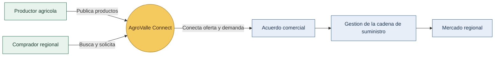
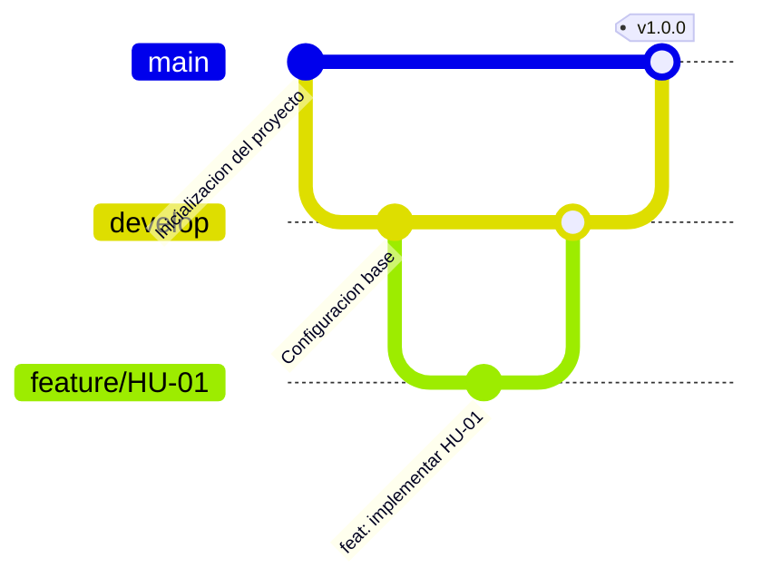

# AgroValle Connect

Plataforma digital para conectar a los productores del Valle del Cauca con mercados regionales y facilitar la comercializacion de productos agricolas.


## Vision del producto

AgroValle Connect integra productores locales, compradores y la cadena de suministro en un solo espacio digital. La plataforma busca mejorar la visibilidad de la oferta agricola, facilitar acuerdos comerciales y optimizar el movimiento de productos desde el campo hasta los mercados regionales.

### Declaracion de la Vision del Producto

> Para **productores del Valle del Cauca**, que **necesitan vender directo** sin depender de intermediarios,
> **AgroValle Connect** es **una plataforma web construida en Java y Spring Boot**
> que **conecta oferta y demanda a precio justo** entre agricultores y compradores regionales.
> A diferencia de **los intermediarios tradicionales de la cadena agricola**,
> nuestro producto **garantiza trazabilidad del pedido y contratos de API transparentes** entre las partes.


## Como funciona



## Alcance inicial

- Registro y gestión de productores y compradores.
- Publicación y consulta de productos agrícolas.
- Solicitudes de compra y acuerdos comerciales.
- Seguimiento de la cadena de suministro.

## Equipo

| Integrantes |
| --- |
| Juan Chicangana |
| Andres Fuelagan |
| Juan Guerrero |
| Miguel Hurtado |

## Tecnologias

- Java 17
- Spring Boot
- Maven
- PostgreSQL
- Git y GitHub

## Estrategia de ramas: GitFlow

Se utiliza GitFlow para separar el desarrollo de nuevas funcionalidades de las versiones estables:

- `main`: versiones estables y entregables.
- `develop`: integración de funcionalidades.
- `feature/*`: desarrollo de historias de usuario.
- `fix/*`: correcciones puntuales.

Los cambios se integran mediante Pull Requests revisados por otro integrante del equipo.

**Justificación:** el equipo optó por GitFlow (en lugar de Trunk-Based Development) porque el tamaño del equipo es pequeño, la dedicación es parcial (estudiantes) y el proyecto aún no cuenta con integración continua real. Aislar cada Historia de Usuario en una rama `feature/*` evita romper `develop` con cambios incompletos, y usar `develop` como rama de integración antes de `main` reduce los tiempos de espera entre integrantes: cada quien avanza en su propia rama y solo debe resolver conflictos al abrir el Pull Request, no en cada commit. Las ramas `feature/*` se mantienen deliberadamente cortas (una historia = una rama) para minimizar el riesgo de "Merge Hell" propio de ramas de larga duración.



## Estructura del proyecto

```text
src/main/java/.../modelo        Entidades JPA (Productor, Producto)
src/main/java/.../repositorio   Repositorios Spring Data JPA
src/main/java/.../controlador   Controladores REST
src/test/java                   Pruebas automatizadas
docs/                            Documentación y Definition of Done
BACKLOG.md                       Historias de usuario y prioridades
checkstyle.xml                   Reglas de calidad de código (Google Java Style)
.husky/pre-commit                Validaciones antes de crear commits (tests + Checkstyle)
```

## Documentacion

- [Product Backlog](BACKLOG.md)
- [Definition of Done](docs/dod.md)
- [Repositorio público en GitHub](https://github.com/el-Andres-F/agrovalle-connect)
